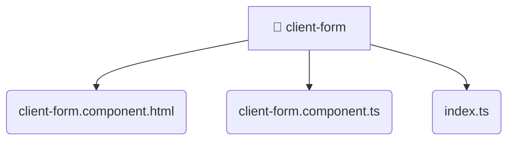

# [frontend](/frontend) / [src](/frontend/src) / [features](/frontend/src/features) / [client-form](/frontend/src/features/client-form)

## 🏷️ 📁 Client-form

### 🎯 PURPOSE
The `client-form` directory forms a critical foundation within the Mavluda Beauty ecosystem, meticulously orchestrating the client-form logic to ensure a seamless and premium experience. Integrated within our cutting-edge Angular frontend architecture, it crafts an elegant, highly-responsive user interface reflecting our luxury brand standards. This module is a distinguished component of the **Features** layer under the Feature Sliced Design (FSD) methodology.

### 🏗️ ARCHITECTURE


### 📄 FILE REGISTRY
| File Name | Type | Responsibility | Key Aliases Used |
|---|---|---|---|
| `client-form.component.html` | `html` | Encapsulates premium logic and definitions for `client-form.component.html`. | None |
| `client-form.component.ts` | `ts` | Encapsulates premium logic and definitions for `client-form.component.ts`. | @angular/common, @angular/core, @shared/lib, @angular/forms, @entities/user |
| `index.ts` | `ts` | Encapsulates premium logic and definitions for `index.ts`. | None |


### 🔗 DEPENDENCIES
- `@angular/common`
- `@angular/core`
- `@angular/forms`
- `@entities/user`
- `@shared/lib`

### 🛠️ USAGE
```typescript
// Seamlessly integrate client-form into your refined workflows:
import { /* exported members */ } from '@path/to/client-form';
```
