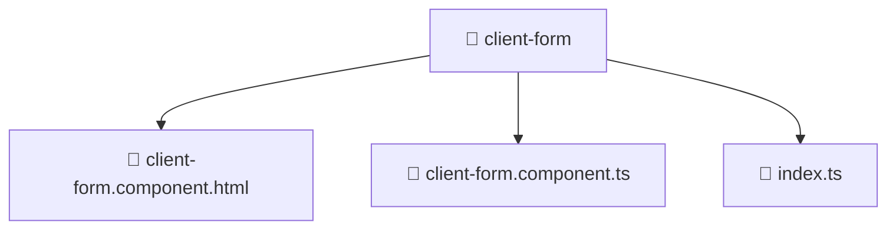

<!--
Mavluda Beauty - Luxury Professional Documentation
Generated for 100% Architectural Transparency
-->
[Home](../../../../README.md) > [frontend](../../../README.md) > [src](../../README.md) > [features](../README.md) > [client-form](./README.md)

# 📁 CLIENT-FORM Directory

> **FSD Layer:** Features

## 🎯 PURPOSE
Encapsulates specific user interactions, forms, and feature-level business logic.

## 🏗️ ARCHITECTURE


## 📄 FILE REGISTRY
| File Name | Type | Responsibility | Key Aliases Used |
|---|---|---|---|
| `client-form.component.html` | HTML Template | UI rendering and component logic. | - |
| `client-form.component.ts` | TypeScript | UI rendering and component logic. | @angular, @entities, @shared |
| `index.ts` | TypeScript | Core logic implementation. | - |


## 🔗 DEPENDENCIES
- `@angular/core`
- `@angular/common`
- `@angular/forms`
- `@entities/user`
- `@shared/lib`

## 🛠️ USAGE
```typescript
// Example placeholder for interacting with client-form
// Consult the individual files in the registry for specific APIs.
```
