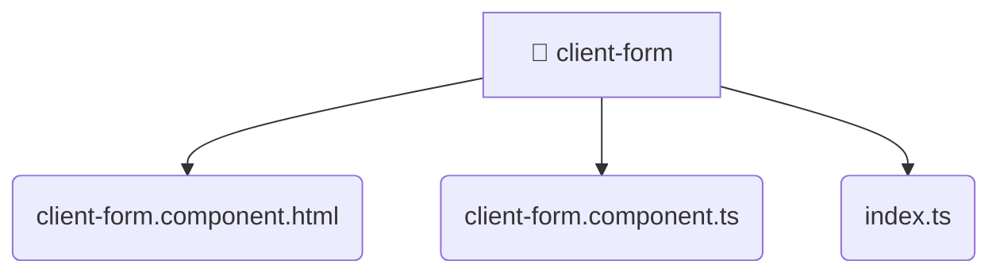

# [root](/) / [frontend](/frontend) / [src](/frontend/src) / [features](/frontend/src/features) / [client-form](/frontend/src/features/client-form)

## 🏷️ 📁 Client-form (Feature Layer)

### 🎯 PURPOSE
The `client-form` feature implements specific user interactions and workflows for client-form.

### 🏗️ ARCHITECTURE


### 📄 FILE REGISTRY
| File Name | Type | Responsibility | Key Aliases Used |
|---|---|---|---|
| `client-form.component.html` | `html` | UI template and styling. | None |
| `client-form.component.ts` | `ts` | UI component logic and rendering. | @angular, @entities, @shared |
| `index.ts` | `ts` | Core logic implementation. | None |

### 🔗 DEPENDENCIES
- `./client-form.component`
- `@angular/common`
- `@angular/core`
- `@angular/forms`
- `@entities/user`
- `@shared/lib`

### 🛠️ USAGE
```typescript
// Seamlessly integrate client-form into your refined workflows:
import { /* exported members */ } from '@path/to/client-form';
```
