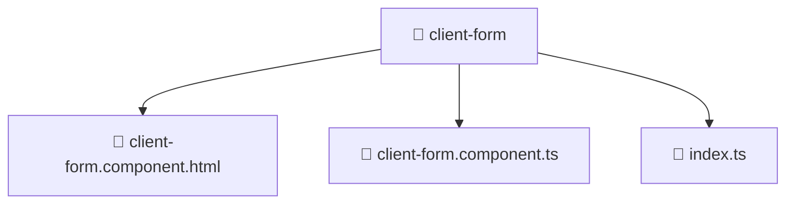

# 📁 Mavluda Beauty client-form

[frontend](/frontend) / [src](/frontend/src) / [features](/frontend/src/features) / [client-form](/frontend/src/features/client-form)

## 🎯 Purpose
Delivering luxury-tier architectural components and high-performance logic for the **client-form** domain. This directory is a crucial part of the Mavluda Beauty full-stack ecosystem, ensuring seamless scalability, robust performance, and an elite digital experience.

> **FSD Layer**: `Features` - Adhering to Feature Sliced Design principles.

## 🏗️ Architecture


## 📄 File Registry
| File Name | Type | Responsibility | Key Aliases Used |
|---|---|---|---|
| `client-form.component.html` | Component | Renders UI and handles user interaction. | N/A |
| `client-form.component.ts` | Component | Renders UI and handles user interaction. | `@angular/core, @angular/common, @angular/forms, @entities/user, @shared/lib` |
| `index.ts` | TypeScript Logic | Core logic and utilities for this domain. | N/A |


## 🔗 Dependencies
**Path Aliases:**
- `@angular/core`
- `@angular/common`
- `@angular/forms`
- `@entities/user`
- `@shared/lib`


## 🛠️ Usage
```typescript
// Example integration for client-form
// Import capabilities from this directory to enrich your modules.
```
> This directory provides specialized logic tailored to the Mavluda Beauty standard.
