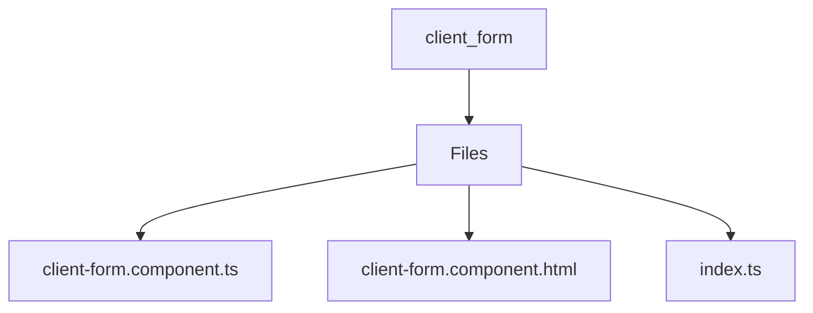

# 🏷️ Client Form Directory

> *Elegance, Precision, and Luxury Professionalism — The Mavluda Beauty Standard.*

## 🧭 Breadcrumb Navigation
[frontend](/frontend) ➔ [src](/frontend/src) ➔ [features](/frontend/src/features) ➔ [client-form](/frontend/src/features/client-form)

## 🎯 Purpose
This directory encapsulates the essential architecture and logic for the **Client Form** domain within the Mavluda Beauty ecosystem. It serves as a foundational component ensuring robust, scalable, and elegant operations.

**Feature Sliced Design (FSD) Layer:** `Feature`

## 🏗️ Architecture


## 📄 File Registry
| File Name | Type | Responsibility | Key Aliases Used |
|---|---|---|---|
| `client-form.component.ts` | TypeScript | Exports: ClientFormComponent | @entities, @shared |
| `client-form.component.html` | HTML Template | Defines logic and structure for client-form.component.html. | None |
| `index.ts` | TypeScript | Defines logic and structure for index.ts. | None |

## 🔗 Dependencies
- `@angular/common`
- `@angular/core`
- `@angular/forms`
- `@entities/user`
- `@shared/lib`

## 🛠️ Usage
```typescript
// To utilize the luxurious capabilities of this module:
import { ClientFormComponent } from './path/to/clientformcomponent';

// Ensure properly typed interactions per Mavluda Beauty standards
```
