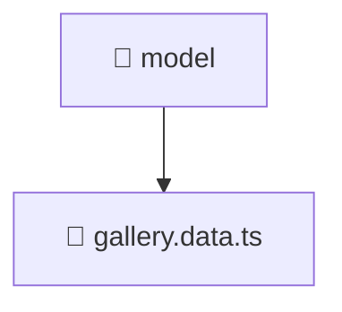

### 🧭 Breadcrumbs
[Root](/) > [frontend](/frontend) > [src](/frontend/src) > [features](/frontend/src/features) > [gallery](/frontend/src/features/gallery) > [model](/frontend/src/features/gallery/model)

# 📁 Model Directory
**Architecture Layer:** Feature Layer

## 🎯 Purpose
Provides luxury professional architectural implementation for the model module within the Mavluda Beauty ecosystem. Ensure robust functionality and elegant integration with the broader architecture.

## 🏗️ ARCHITECTURE


## 📄 FILE REGISTRY
| File Name | Type | Responsibility | Key Aliases Used |
|---|---|---|---|
| `gallery.data.ts` | TypeScript | Provides core logic and orchestration for gallery.data.ts. | @shared/models, @angular/forms/signals |

## 🔗 DEPENDENCIES
- `@angular/forms/signals`
- `@shared/models`

## 🛠️ USAGE
```typescript
// Example architectural integration for model
// Utilize the exported members according to Mavluda Beauty's standard conventions.
```

---
*Maintained by Mavluda Beauty - Architecture & Engineering*

---
*Maintained by Mavluda Beauty - Architecture & Engineering*