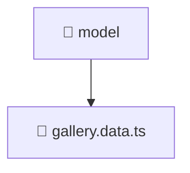

<!--
Mavluda Beauty - Luxury Professional Documentation
Generated for 100% Architectural Transparency
-->
[Home](../../../../../README.md) > [frontend](../../../../README.md) > [src](../../../README.md) > [features](../../README.md) > [gallery](../README.md) > [model](./README.md)

# 📁 MODEL Directory

> **FSD Layer:** Features

## 🎯 PURPOSE
Encapsulates specific user interactions, forms, and feature-level business logic.

## 🏗️ ARCHITECTURE


## 📄 FILE REGISTRY
| File Name | Type | Responsibility | Key Aliases Used |
|---|---|---|---|
| `gallery.data.ts` | TypeScript | Core logic implementation. | @angular, @shared |


## 🔗 DEPENDENCIES
- `@angular/forms/signals`
- `@shared/models`

## 🛠️ USAGE
```typescript
// Example placeholder for interacting with model
// Consult the individual files in the registry for specific APIs.
```
