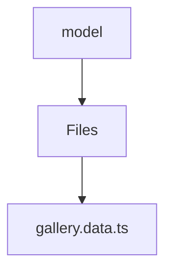

# 🏷️ Model Directory

> *Elegance, Precision, and Luxury Professionalism — The Mavluda Beauty Standard.*

## 🧭 Breadcrumb Navigation
[frontend](/frontend) ➔ [src](/frontend/src) ➔ [features](/frontend/src/features) ➔ [gallery](/frontend/src/features/gallery) ➔ [model](/frontend/src/features/gallery/model)

## 🎯 Purpose
This directory encapsulates the essential architecture and logic for the **Model** domain within the Mavluda Beauty ecosystem. It serves as a foundational component ensuring robust, scalable, and elegant operations.

**Feature Sliced Design (FSD) Layer:** `Feature`

## 🏗️ Architecture


## 📄 File Registry
| File Name | Type | Responsibility | Key Aliases Used |
|---|---|---|---|
| `gallery.data.ts` | TypeScript | Exports: galleryFormData, resetGalleryData, galleryValidationSchema | @shared |

## 🔗 Dependencies
- `@angular/forms/signals`
- `@shared/models`

## 🛠️ Usage
```typescript
// To utilize the luxurious capabilities of this module:
import { galleryFormData } from './path/to/galleryformdata';

// Ensure properly typed interactions per Mavluda Beauty standards
```
