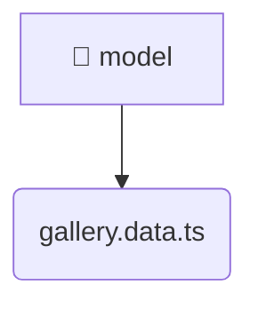

# [root](/) / [frontend](/frontend) / [src](/frontend/src) / [features](/frontend/src/features) / [gallery](/frontend/src/features/gallery) / [model](/frontend/src/features/gallery/model)

## 🏷️ 📁 Model (Feature Layer)

### 🎯 PURPOSE
The `model` feature implements specific user interactions and workflows for model.

### 🏗️ ARCHITECTURE


### 📄 FILE REGISTRY
| File Name | Type | Responsibility | Key Aliases Used |
|---|---|---|---|
| `gallery.data.ts` | `ts` | Core logic implementation. | @angular, @shared |

### 🔗 DEPENDENCIES
- `@angular/forms/signals`
- `@shared/models`

### 🛠️ USAGE
```typescript
// Seamlessly integrate model into your refined workflows:
import { /* exported members */ } from '@path/to/model';
```
