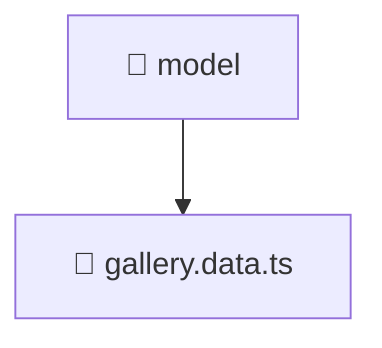

# 📁 Mavluda Beauty model

[frontend](/frontend) / [src](/frontend/src) / [features](/frontend/src/features) / [gallery](/frontend/src/features/gallery) / [model](/frontend/src/features/gallery/model)

## 🎯 Purpose
Delivering luxury-tier architectural components and high-performance logic for the **model** domain. This directory is a crucial part of the Mavluda Beauty full-stack ecosystem, ensuring seamless scalability, robust performance, and an elite digital experience.

> **FSD Layer**: `Features` - Adhering to Feature Sliced Design principles.

## 🏗️ Architecture


## 📄 File Registry
| File Name | Type | Responsibility | Key Aliases Used |
|---|---|---|---|
| `gallery.data.ts` | TypeScript Logic | Core logic and utilities for this domain. | `@angular/forms/signals, @shared/models` |


## 🔗 Dependencies
**Path Aliases:**
- `@angular/forms/signals`
- `@shared/models`


## 🛠️ Usage
```typescript
// Example integration for model
// Import capabilities from this directory to enrich your modules.
```
> This directory provides specialized logic tailored to the Mavluda Beauty standard.
