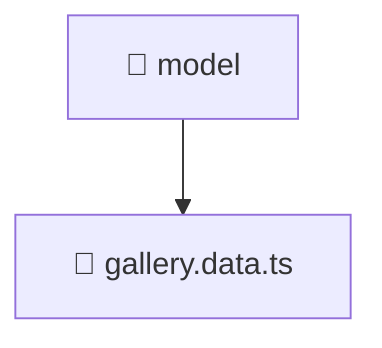

# 📁 model

[Root](/../../../../../README.md) / [frontend](../../../../README.md) / [src](../../../README.md) / [features](../../README.md) / [gallery](../README.md) / [model](./README.md)

## 🎯 Purpose
Delivering luxury-tier architectural components and high-performance logic for the **model** domain. This directory is a crucial part of the Mavluda Beauty full-stack ecosystem, ensuring seamless scalability, robust performance, and an elite digital experience.

**FSD Layer:** Features

## 🏗️ Architecture


## 📄 File Registry
| File Name | Type | Responsibility | Key Aliases Used |
|---|---|---|---|
| `gallery.data.ts` | TypeScript | Provides core logic and orchestration for gallery.data.ts. | @angular, @shared |


## 🔗 Dependencies
**Internal / Aliases:**
- `@angular/forms/signals`
- `@shared/models`


## 🛠️ Usage
```typescript
// Example usage within the Mavluda Beauty ecosystem
import { relevantMember } from './gallery.data';

// Integrate into the application architecture
relevantMember.execute();
```
