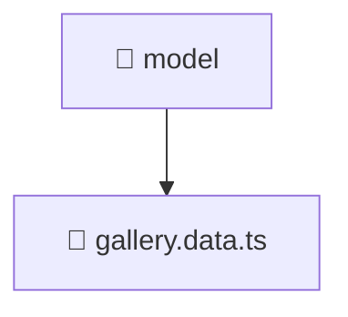

# 📁 model

[Root](/.) > [frontend](/frontend) > [src](/frontend/src) > [features](/frontend/src/features) > [gallery](/frontend/src/features/gallery) > [model](/frontend/src/features/gallery/model)

## 🎯 Purpose
Delivering luxury-tier architectural components and high-performance logic for the **model** domain. This directory is a crucial part of the Mavluda Beauty full-stack ecosystem, ensuring seamless scalability, robust performance, and an elite digital experience.

## 🏗️ Architecture


## 📄 File Registry
| File Name | Type | Responsibility | Key Aliases Used |
|---|---|---|---|
| `gallery.data.ts` | TypeScript | Handles logic and definitions for gallery.data.ts | @angular/forms/signals, @shared/models |

## 🔗 Dependencies
- `@angular/forms/signals`
- `@shared/models`

## 🛠️ Usage
```typescript
// Example usage within the Mavluda Beauty ecosystem
import { relevantMember } from './model';

// Integrate into the application architecture
relevantMember.execute();
```
