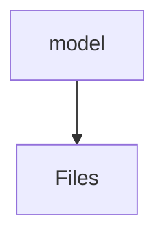

# 📁 Model Directory

[frontend](/frontend) > [src](/frontend/src) > [features](/frontend/src/features) > [gallery](/frontend/src/features/gallery) > [model](/frontend/src/features/gallery/model)

## 🎯 Purpose
A high-level module handling `model` logic within the Mavluda Beauty ecosystem. This directory adheres to our "Luxury Professional" architectural standards.

**FSD Layer:** Features


## 🏗️ Architecture



## 📄 File Registry
| File Name | Type | Responsibility | Key Aliases Used |
|-----------|------|----------------|------------------|
| `gallery.data.ts` | TypeScript | Provides localized typescript definitions. | @angular/forms/signals, @shared/models |

## 🔗 Dependencies
- `@angular/forms/signals`
- `@shared/models`

## 🛠️ Usage
```typescript
// Architectural overview snippet
import { InternalLogic } from './internal-file';
// Ensure adherence to Hexagonal / FSD principles
```
