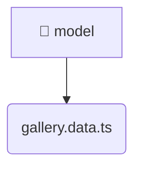

# [frontend](/frontend) / [src](/frontend/src) / [features](/frontend/src/features) / [gallery](/frontend/src/features/gallery) / [model](/frontend/src/features/gallery/model)

## 🏷️ 📁 Model

### 🎯 PURPOSE
The `model` directory forms a critical foundation within the Mavluda Beauty ecosystem, meticulously orchestrating the model logic to ensure a seamless and premium experience. Integrated within our cutting-edge Angular frontend architecture, it crafts an elegant, highly-responsive user interface reflecting our luxury brand standards. This module is a distinguished component of the **Features** layer under the Feature Sliced Design (FSD) methodology.

### 🏗️ ARCHITECTURE


### 📄 FILE REGISTRY
| File Name | Type | Responsibility | Key Aliases Used |
|---|---|---|---|
| `gallery.data.ts` | `ts` | Encapsulates premium logic and definitions for `gallery.data.ts`. | @shared/models, @angular/forms/signals |


### 🔗 DEPENDENCIES
- `@angular/forms/signals`
- `@shared/models`

### 🛠️ USAGE
```typescript
// Seamlessly integrate model into your refined workflows:
import { /* exported members */ } from '@path/to/model';
```
