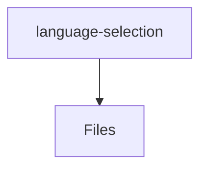

# 📁 Language-Selection Directory

[frontend](/frontend) > [src](/frontend/src) > [features](/frontend/src/features) > [language-selection](/frontend/src/features/language-selection)

## 🎯 Purpose
A high-level module handling `language-selection` logic within the Mavluda Beauty ecosystem. This directory adheres to our "Luxury Professional" architectural standards.

**FSD Layer:** Features


## 🏗️ Architecture



## 📄 File Registry
| File Name | Type | Responsibility | Key Aliases Used |
|-----------|------|----------------|------------------|
| `index.ts` | TypeScript | Provides localized typescript definitions. | None |
| `language-switcher.component.html` | Template | Angular UI standalone component logic. | None |
| `language-switcher.component.scss` | Style | Angular UI standalone component logic. | None |
| `language-switcher.component.ts` | Component | Angular UI standalone component logic. | @angular/core, @angular/common |

## 🔗 Dependencies
- `@angular/common`
- `@angular/core`

## 🛠️ Usage
```typescript
// Architectural overview snippet
import { InternalLogic } from './internal-file';
// Ensure adherence to Hexagonal / FSD principles
```
