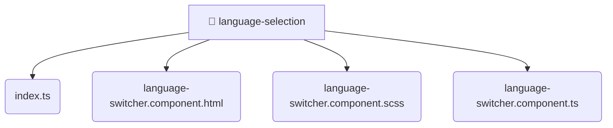

# [root](/) / [frontend](/frontend) / [src](/frontend/src) / [features](/frontend/src/features) / [language-selection](/frontend/src/features/language-selection)

## 🏷️ 📁 Language-selection

### 🎯 PURPOSE
The `language-selection` directory forms a critical foundation within the Mavluda Beauty ecosystem, meticulously orchestrating the language-selection logic to ensure a seamless and premium experience.

This directory resides within the **Features** layer of our Feature Sliced Design (FSD) architecture, strictly adhering to Mavluda Beauty's robust separation of concerns.

### 🏗️ ARCHITECTURE


### 📄 FILE REGISTRY
| File Name | Type | Responsibility | Key Aliases Used |
|---|---|---|---|
| `index.ts` | `ts` | Core logic implementation. | None |
| `language-switcher.component.html` | `html` | UI template and styling. | None |
| `language-switcher.component.scss` | `scss` | UI template and styling. | None |
| `language-switcher.component.ts` | `ts` | UI component logic and rendering. | @angular |

### 🔗 DEPENDENCIES
- `./language-switcher.component`
- `@angular/common`
- `@angular/core`

### 🛠️ USAGE
```typescript
// Seamlessly integrate language-selection into your refined workflows:
import { /* exported members */ } from '@path/to/language-selection';
```
