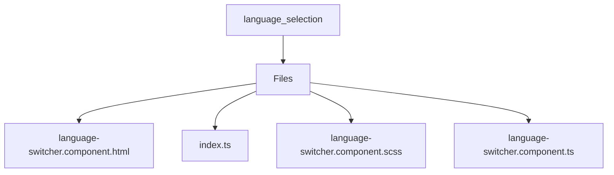

# 🏷️ Language Selection Directory

> *Elegance, Precision, and Luxury Professionalism — The Mavluda Beauty Standard.*

## 🧭 Breadcrumb Navigation
[frontend](/frontend) ➔ [src](/frontend/src) ➔ [features](/frontend/src/features) ➔ [language-selection](/frontend/src/features/language-selection)

## 🎯 Purpose
This directory encapsulates the essential architecture and logic for the **Language Selection** domain within the Mavluda Beauty ecosystem. It serves as a foundational component ensuring robust, scalable, and elegant operations.

**Feature Sliced Design (FSD) Layer:** `Feature`

## 🏗️ Architecture


## 📄 File Registry
| File Name | Type | Responsibility | Key Aliases Used |
|---|---|---|---|
| `language-switcher.component.html` | HTML Template | Defines logic and structure for language-switcher.component.html. | None |
| `index.ts` | TypeScript | Defines logic and structure for index.ts. | None |
| `language-switcher.component.scss` | Stylesheet | Defines logic and structure for language-switcher.component.scss. | None |
| `language-switcher.component.ts` | TypeScript | Exports: LanguageSwitcherComponent | None |

## 🔗 Dependencies
- `@angular/common`
- `@angular/core`

## 🛠️ Usage
```typescript
// To utilize the luxurious capabilities of this module:
import { LanguageSwitcherComponent } from './path/to/languageswitchercomponent';

// Ensure properly typed interactions per Mavluda Beauty standards
```
