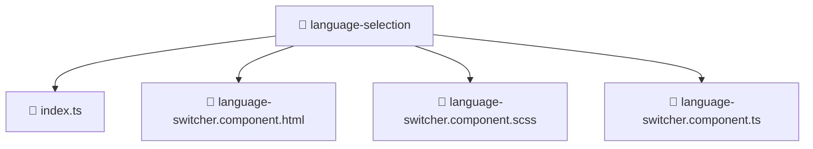

### 🧭 Breadcrumbs
[Root](/) > [frontend](/frontend) > [src](/frontend/src) > [features](/frontend/src/features) > [language-selection](/frontend/src/features/language-selection)

# 📁 Language-selection Directory
**Architecture Layer:** Feature Layer

## 🎯 Purpose
Provides luxury professional architectural implementation for the language-selection module within the Mavluda Beauty ecosystem. Ensure robust functionality and elegant integration with the broader architecture.

## 🏗️ ARCHITECTURE


## 📄 FILE REGISTRY
| File Name | Type | Responsibility | Key Aliases Used |
|---|---|---|---|
| `index.ts` | TypeScript | Provides core logic and orchestration for index.ts. | N/A |
| `language-switcher.component.html` | HTML Template | Structural template and layout for language-switcher.component.html. | N/A |
| `language-switcher.component.scss` | Stylesheet | Luxury styling and visual presentation for language-switcher.component.scss. | N/A |
| `language-switcher.component.ts` | TypeScript | UI component logic and state management for language-switcher.component.ts. | @angular/core, @angular/common |

## 🔗 DEPENDENCIES
- `@angular/common`
- `@angular/core`

## 🛠️ USAGE
```typescript
// Example architectural integration for language-selection
// Utilize the exported members according to Mavluda Beauty's standard conventions.
```

---
*Maintained by Mavluda Beauty - Architecture & Engineering*

---
*Maintained by Mavluda Beauty - Architecture & Engineering*