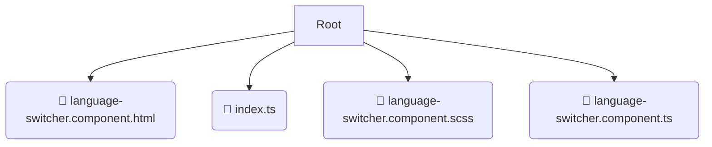

# 📂 language-selection

*Breadcrumbs:* [frontend](/frontend) / [src](/frontend/src) / [features](/frontend/src/features) / [language-selection](/frontend/src/features/language-selection)

## 🎯 PURPOSE
This directory `language-selection` is an integral part of the Mavluda Beauty ecosystem. (FSD Layer: Features) It implements business value features, bringing together entities and shared elements.
This directory is meticulously maintained to uphold the 'Luxury Professional' standards of the Mavluda Beauty brand.

## 🏗️ ARCHITECTURE


## 📄 FILE REGISTRY
| File Name | Type | Responsibility | Key Aliases Used |
|---|---|---|---|
| `language-switcher.component.html` | `html` | UI Template | `None` |
| `index.ts` | `ts` | Core functionality | `None` |
| `language-switcher.component.scss` | `scss` | Styling | `None` |
| `language-switcher.component.ts` | `ts` | UI Component logic | `@angular/core, @angular/common` |

## 🔗 DEPENDENCIES
- `@angular/core`
- `@angular/common`

## 🛠️ USAGE
```typescript
// Example placeholder for interacting with the language-selection module
import { example } from './language-switcher.component.html';
```
