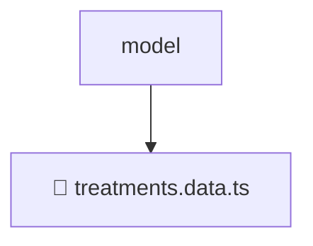

# 📂 MODEL

> 💎 **Mavluda Beauty - Luxury Professional Architecture**

### 📍 Breadcrumb Navigation
`. > frontend > src > features > treatments > model`

## 🎯 PURPOSE
This directory encapsulates `Features` level functionality within the Mavluda Beauty ecosystem, ensuring proper separation of concerns and architectural transparency.

**FSD / Architecture Layer:** `Features`

## 🏗️ ARCHITECTURE


## 📄 FILE REGISTRY

| Item Name | Type | Responsibility | Key Aliases Used |
|-----------|------|----------------|------------------|
| `📄 treatments.data.ts` | `.ts` | General functionality | `@angular/forms/signals` |

## 🔗 DEPENDENCIES
- `@angular/forms/signals`

## 🛠️ USAGE
```typescript
// Example usage context
import { ... } from './treatments.data';

// Integrate treatments.data logic into your feature.
```
