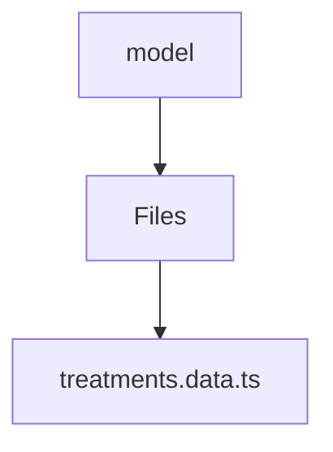

# 🏷️ Model Directory

> *Elegance, Precision, and Luxury Professionalism — The Mavluda Beauty Standard.*

## 🧭 Breadcrumb Navigation
[frontend](/frontend) ➔ [src](/frontend/src) ➔ [features](/frontend/src/features) ➔ [treatments](/frontend/src/features/treatments) ➔ [model](/frontend/src/features/treatments/model)

## 🎯 Purpose
This directory encapsulates the essential architecture and logic for the **Model** domain within the Mavluda Beauty ecosystem. It serves as a foundational component ensuring robust, scalable, and elegant operations.

**Feature Sliced Design (FSD) Layer:** `Feature`

## 🏗️ Architecture


## 📄 File Registry
| File Name | Type | Responsibility | Key Aliases Used |
|---|---|---|---|
| `treatments.data.ts` | TypeScript | Exports: TreatmentItem, resetTreatmentData, treatmentsValidationSchema | None |

## 🔗 Dependencies
- `@angular/forms/signals`

## 🛠️ Usage
```typescript
// To utilize the luxurious capabilities of this module:
import { TreatmentItem } from './path/to/treatmentitem';

// Ensure properly typed interactions per Mavluda Beauty standards
```
