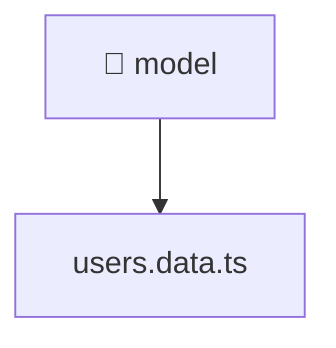

[🏠 Home](../../../../../README.md) > [frontend](../../../../README.md) > [src](../../../README.md) > [features](../../README.md) > [user](../README.md) > [model](./README.md)

# 📁 model

**FSD Layer:** `Features`

### 🎯 PURPOSE
Welcome to the exquisite **model** module of the Mavluda Beauty ecosystem. This directory handles specific domain assets and logic. It is designed adhering to our 'Luxury Professional' standards.

### 🏗️ ARCHITECTURE


### 📄 FILE REGISTRY
| File Name | Type | Responsibility | Key Aliases Used |
|---|---|---|---|
| `users.data.ts` | TypeScript File | Provides logic and definitions for users.data.ts. | None |

### 🔗 DEPENDENCIES
No notable dependencies detected.

### 🛠️ USAGE
```typescript
// Example interaction or integration snippet
// Import members from model based on module boundaries
```
