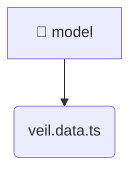

# [root](/) / [frontend](/frontend) / [src](/frontend/src) / [features](/frontend/src/features) / [veil](/frontend/src/features/veil) / [model](/frontend/src/features/veil/model)

## 🏷️ 📁 Model

### 🎯 PURPOSE
The `model` directory forms a critical foundation within the Mavluda Beauty ecosystem, meticulously orchestrating the model logic to ensure a seamless and premium experience.

This directory resides within the **Features** layer of our Feature Sliced Design (FSD) architecture, strictly adhering to Mavluda Beauty's robust separation of concerns.

### 🏗️ ARCHITECTURE


### 📄 FILE REGISTRY
| File Name | Type | Responsibility | Key Aliases Used |
|---|---|---|---|
| `veil.data.ts` | `ts` | Core logic implementation. | @angular |

### 🔗 DEPENDENCIES
- `@angular/forms/signals`

### 🛠️ USAGE
```typescript
// Seamlessly integrate model into your refined workflows:
import { /* exported members */ } from '@path/to/model';
```
