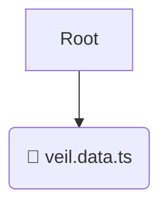

# 📂 model

*Breadcrumbs:* [frontend](/frontend) / [src](/frontend/src) / [features](/frontend/src/features) / [veil](/frontend/src/features/veil) / [model](/frontend/src/features/veil/model)

## 🎯 PURPOSE
This directory `model` is an integral part of the Mavluda Beauty ecosystem. (FSD Layer: Features) It implements business value features, bringing together entities and shared elements.
This directory is meticulously maintained to uphold the 'Luxury Professional' standards of the Mavluda Beauty brand.

## 🏗️ ARCHITECTURE


## 📄 FILE REGISTRY
| File Name | Type | Responsibility | Key Aliases Used |
|---|---|---|---|
| `veil.data.ts` | `ts` | Core functionality | `@angular/forms/signals` |

## 🔗 DEPENDENCIES
- `@angular/forms/signals`

## 🛠️ USAGE
```typescript
// Example placeholder for interacting with the model module
import { example } from './veil.data.ts';
```
