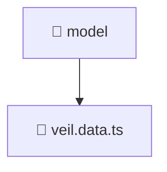

# 📁 model

[Root](/.) > [frontend](/frontend) > [src](/frontend/src) > [features](/frontend/src/features) > [veil](/frontend/src/features/veil) > [model](/frontend/src/features/veil/model)

**FSD Layer:** Feature

## 🎯 Purpose
Delivering luxury-tier architectural components and logic for the **model** domain. Ensuring seamless scalability, robust performance, and an elite digital experience in the Mavluda Beauty ecosystem.

## 🏗️ Architecture


## 📄 File Registry
| File Name | Type | Responsibility | Key Aliases Used |
|---|---|---|---|
| `veil.data.ts` | TypeScript | Provides core logic and orchestration for veil.data.ts. | @angular |

## 🔗 Dependencies
- `@angular/forms/signals`

## 🛠️ Usage
```typescript
// Example usage within the Mavluda Beauty ecosystem
import { relevantMember } from './';
```
