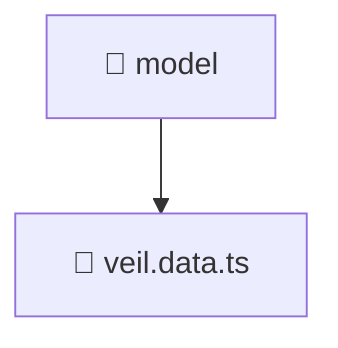

[Root](/.) > [frontend](/frontend) > [src](/frontend/src) > [features](/frontend/src/features) > [veil](/frontend/src/features/veil) > [model](/frontend/src/features/veil/model)

# 📁 Model (Feature Layer)

## 🎯 Purpose
Delivering luxury-tier architectural components and high-performance logic for the **model** domain. This directory is a crucial part of the Mavluda Beauty full-stack ecosystem, ensuring seamless scalability, robust performance, and an elite digital experience.
This directory operates within the **Feature Layer** of the Feature Sliced Design (FSD) architecture.

## 🏗️ Architecture


## 📄 File Registry
| File Name | Type | Responsibility | Key Aliases Used |
|---|---|---|---|
| `veil.data.ts` | TypeScript | Provides core logic and orchestration for veil.data.ts. | @angular |

## 🔗 Dependencies
- `@angular/forms/signals`

## 🛠️ Usage
```typescript
// Example usage within the Mavluda Beauty ecosystem
import { relevantMember } from './core';

// Integrate into the application architecture
relevantMember.execute();
```