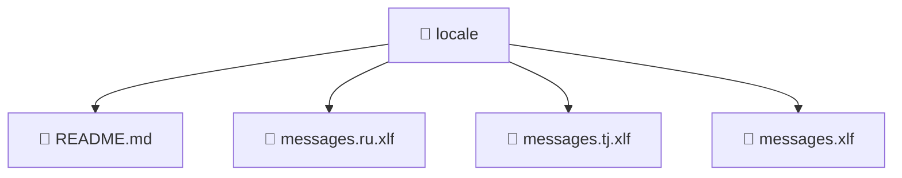

# 📁 locale

[Root](/.) > [frontend](/frontend) > [src](/frontend/src) > [locale](/frontend/src/locale)

## 🎯 Purpose
Delivering luxury-tier architectural components and high-performance logic for the **locale** domain. This directory is a crucial part of the Mavluda Beauty full-stack ecosystem, ensuring seamless scalability, robust performance, and an elite digital experience.

## 🏗️ Architecture


## 📄 File Registry
| File Name | Type | Responsibility | Key Aliases Used |
|---|---|---|---|
| `README.md` | Markdown | Provides core logic and configuration for README.md. | N/A |
| `messages.ru.xlf` | File | Provides core logic and orchestration for messages.ru.xlf. | N/A |
| `messages.tj.xlf` | File | Provides core logic and orchestration for messages.tj.xlf. | N/A |
| `messages.xlf` | File | Provides core logic and orchestration for messages.xlf. | N/A |

## 🔗 Dependencies
- `./locale`

## 🛠️ Usage
```typescript
// Example usage within the Mavluda Beauty ecosystem
import { relevantMember } from './locale';

// Integrate into the application architecture
relevantMember.execute();
```
