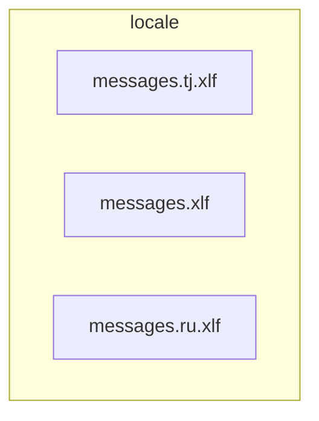

# 📁 locale

[frontend](../../README.md) > [src](../README.md) > [locale](README.md)

---

### 🎯 PURPOSE
Elevating the digital experience for the Mavluda Beauty ecosystem, this module manages the sophisticated Root / Operational Layer operations.

*FSD Layer:* **Root / Operational Layer**

---

### 🏗️ ARCHITECTURE



---

### 📄 FILE REGISTRY
| File Name | Type | Responsibility | Key Aliases Used |
|-----------|------|----------------|------------------|
| `messages.tj.xlf` | Source | Handles source logic for Mavluda Beauty's luxury standards. | `None` |
| `messages.xlf` | Source | Handles source logic for Mavluda Beauty's luxury standards. | `None` |
| `messages.ru.xlf` | Source | Handles source logic for Mavluda Beauty's luxury standards. | `None` |

---

### 🔗 DEPENDENCIES
No external or internal dependencies detected.

---

### 🛠️ USAGE
To interact with this directory's luxurious logic, integrate its exported components or services directly into your feature modules. Ensure strict adherence to the Root / Operational Layer boundaries.

```typescript
// Example integration snippet
import { FeatureModule } from '@path/to/locale';
```
