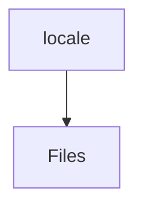

# 📁 Locale Directory

[frontend](/frontend) > [src](/frontend/src) > [locale](/frontend/src/locale)

## 🎯 Purpose
A high-level module handling `locale` logic within the Mavluda Beauty ecosystem. This directory adheres to our "Luxury Professional" architectural standards.


## 🏗️ Architecture



## 📄 File Registry
| File Name | Type | Responsibility | Key Aliases Used |
|-----------|------|----------------|------------------|
| `messages.ru.xlf` | File | Provides localized file definitions. | None |
| `messages.tj.xlf` | File | Provides localized file definitions. | None |
| `messages.xlf` | File | Provides localized file definitions. | None |

## 🔗 Dependencies
- No major internal/external path aliases detected.

## 🛠️ Usage
```typescript
// Architectural overview snippet
import { InternalLogic } from './internal-file';
// Ensure adherence to Hexagonal / FSD principles
```
