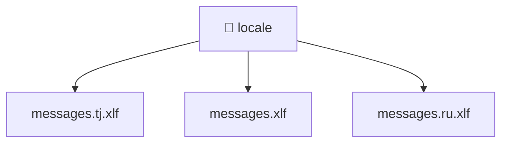

[🏠 Home](../../../README.md) > [frontend](../../README.md) > [src](../README.md) > [locale](./README.md)

# 📁 locale

### 🎯 PURPOSE
Welcome to the exquisite **locale** module of the Mavluda Beauty ecosystem. This directory handles specific domain assets and logic. It is designed adhering to our 'Luxury Professional' standards.

### 🏗️ ARCHITECTURE


### 📄 FILE REGISTRY
| File Name | Type | Responsibility | Key Aliases Used |
|---|---|---|---|
| `messages.ru.xlf` | Asset / File | Provides logic and definitions for messages.ru.xlf. | None |
| `messages.tj.xlf` | Asset / File | Provides logic and definitions for messages.tj.xlf. | None |
| `messages.xlf` | Asset / File | Provides logic and definitions for messages.xlf. | None |

### 🔗 DEPENDENCIES
No notable dependencies detected.

### 🛠️ USAGE
```typescript
// Example interaction or integration snippet
// Import members from locale based on module boundaries
```
