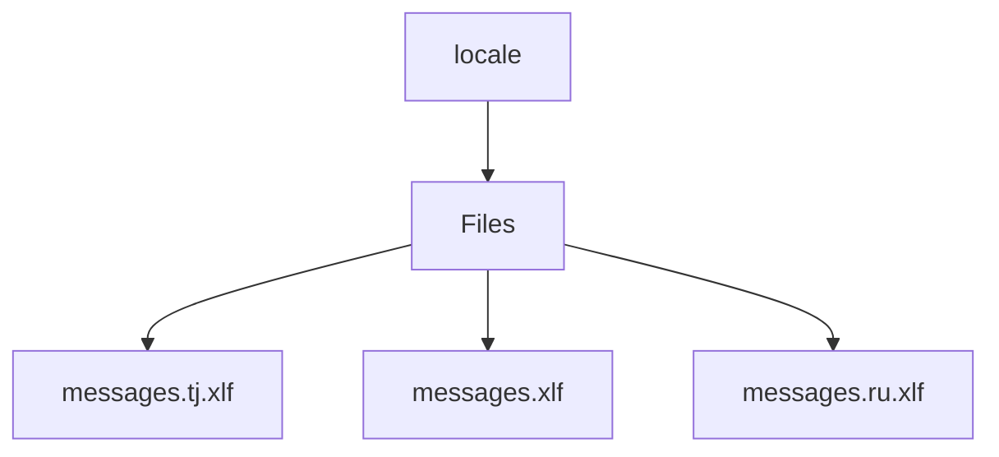

# 🏷️ Locale Directory

> *Elegance, Precision, and Luxury Professionalism — The Mavluda Beauty Standard.*

## 🧭 Breadcrumb Navigation
[frontend](/frontend) ➔ [src](/frontend/src) ➔ [locale](/frontend/src/locale)

## 🎯 Purpose
This directory encapsulates the essential architecture and logic for the **Locale** domain within the Mavluda Beauty ecosystem. It serves as a foundational component ensuring robust, scalable, and elegant operations.

## 🏗️ Architecture


## 📄 File Registry
| File Name | Type | Responsibility | Key Aliases Used |
|---|---|---|---|
| `messages.tj.xlf` | File | Defines logic and structure for messages.tj.xlf. | None |
| `messages.xlf` | File | Defines logic and structure for messages.xlf. | None |
| `messages.ru.xlf` | File | Defines logic and structure for messages.ru.xlf. | None |

## 🔗 Dependencies
No external or cross-module dependencies detected.

## 🛠️ Usage
```typescript
// This directory primarily serves organizational or static purposes.
// Reference its contents dynamically based on your feature requirements.
```
