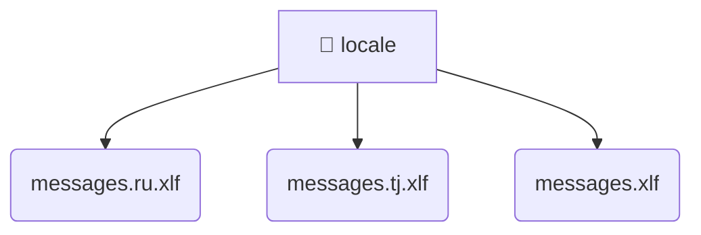

# [root](/) / [frontend](/frontend) / [src](/frontend/src) / [locale](/frontend/src/locale)

## 🏷️ 📁 Locale

### 🎯 PURPOSE
The `locale` directory handles frontend architecture and configuration for the Mavluda Beauty platform.

### 🏗️ ARCHITECTURE


### 📄 FILE REGISTRY
| File Name | Type | Responsibility | Key Aliases Used |
|---|---|---|---|
| `messages.ru.xlf` | `xlf` | Core logic or foundational asset for this directory. | None |
| `messages.tj.xlf` | `xlf` | Core logic or foundational asset for this directory. | None |
| `messages.xlf` | `xlf` | Core logic or foundational asset for this directory. | None |

### 🔗 DEPENDENCIES
- `None`

### 🛠️ USAGE
```typescript
// Seamlessly integrate locale into your refined workflows:
import { /* exported members */ } from '@path/to/locale';
```
