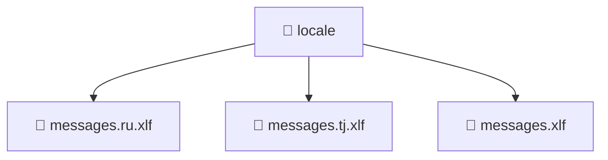

# 📁 locale

[Root](/../../../README.md) / [frontend](../../README.md) / [src](../README.md) / [locale](./README.md)

## 🎯 Purpose
Delivering luxury-tier architectural components and high-performance logic for the **locale** domain. This directory is a crucial part of the Mavluda Beauty full-stack ecosystem, ensuring seamless scalability, robust performance, and an elite digital experience.

## 🏗️ Architecture


## 📄 File Registry
| File Name | Type | Responsibility | Key Aliases Used |
|---|---|---|---|
| `messages.ru.xlf` | File | Provides core logic and orchestration for messages.ru.xlf. | N/A |
| `messages.tj.xlf` | File | Provides core logic and orchestration for messages.tj.xlf. | N/A |
| `messages.xlf` | File | Provides core logic and orchestration for messages.xlf. | N/A |


## 🔗 Dependencies
- No external dependencies.

## 🛠️ Usage
```typescript
// Example usage within the Mavluda Beauty ecosystem
import { relevantMember } from './core';

// Integrate into the application architecture
relevantMember.execute();
```
