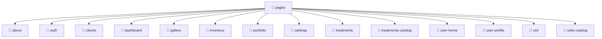

# 📁 Pages Directory

[Root](/.) / [frontend](/frontend) / [src](/frontend/src) / [pages](/frontend/src/pages)

## 🎯 Purpose
Delivering luxury-tier architectural components and high-performance logic for the **pages** domain. This directory is a crucial part of the Mavluda Beauty full-stack ecosystem, ensuring seamless scalability, robust performance, and an elite digital experience.
**FSD Layer:** Pages


## 🏗️ Architecture


## 📄 File Registry
| File Name | Type | Responsibility | Key Aliases Used |
|---|---|---|---|
| `about` | Directory | Contains architectural sub-modules and layer logic for about. | N/A |
| `auth` | Directory | Contains architectural sub-modules and layer logic for auth. | N/A |
| `clients` | Directory | Contains architectural sub-modules and layer logic for clients. | N/A |
| `dashboard` | Directory | Contains architectural sub-modules and layer logic for dashboard. | N/A |
| `gallery` | Directory | Contains architectural sub-modules and layer logic for gallery. | N/A |
| `inventory` | Directory | Contains architectural sub-modules and layer logic for inventory. | N/A |
| `portfolio` | Directory | Contains architectural sub-modules and layer logic for portfolio. | N/A |
| `settings` | Directory | Contains architectural sub-modules and layer logic for settings. | N/A |
| `treatments` | Directory | Contains architectural sub-modules and layer logic for treatments. | N/A |
| `treatments-catalog` | Directory | Contains architectural sub-modules and layer logic for treatments-catalog. | N/A |
| `user-home` | Directory | Contains architectural sub-modules and layer logic for user-home. | N/A |
| `user-profile` | Directory | Contains architectural sub-modules and layer logic for user-profile. | N/A |
| `veil` | Directory | Contains architectural sub-modules and layer logic for veil. | N/A |
| `veils-catalog` | Directory | Contains architectural sub-modules and layer logic for veils-catalog. | N/A |

## 🔗 Dependencies
- Relies on internal Mavluda Beauty architecture and designated FSD layers.
- See 'Key Aliases Used' in the File Registry for explicit cross-domain references.

## 🛠️ Usage
```typescript
// Example usage within the Mavluda Beauty ecosystem
import { relevantMember } from './core';

// Integrate into the application architecture
relevantMember.execute();
```
