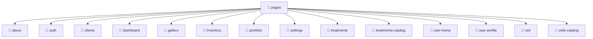

# 🍰 pages

[Root](/.) / [frontend](../..) / [src](..) / [pages](.)

## 🎯 Purpose
Delivering luxury-tier architectural components and high-performance logic for the **pages** domain. This directory orchestrates precise operations within the Mavluda Beauty ecosystem, maintaining our elite standards of digital excellence.

*This directory operates strictly within the **Pages** layer of our Feature Sliced Design (FSD) architecture.*

## 🏗️ Architecture


## 📄 File Registry
| File Name | Type | Responsibility | Key Aliases Used |
|---|---|---|---|
| *No files* | - | - | - |

## 🔗 Dependencies
*No internal path aliases detected in this directory.*

## 🛠️ Usage
```markdown
> This directory acts primarily as a structural container or logic module.
> To interact with its contents, import the relevant exported members from the `index.ts` or specifically targeted files.
```
