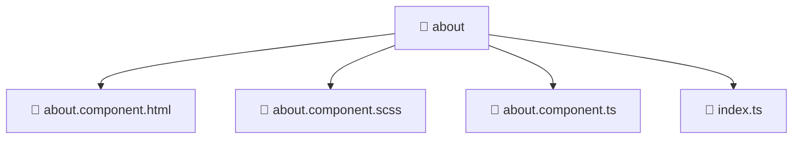

### 🧭 Breadcrumbs
[Root](/) > [frontend](/frontend) > [src](/frontend/src) > [pages](/frontend/src/pages) > [about](/frontend/src/pages/about)

# 📁 About Directory
**Architecture Layer:** Page Layer

## 🎯 Purpose
Provides luxury professional architectural implementation for the about module within the Mavluda Beauty ecosystem. Ensure robust functionality and elegant integration with the broader architecture.

## 🏗️ ARCHITECTURE


## 📄 FILE REGISTRY
| File Name | Type | Responsibility | Key Aliases Used |
|---|---|---|---|
| `about.component.html` | HTML Template | Structural template and layout for about.component.html. | N/A |
| `about.component.scss` | Stylesheet | Luxury styling and visual presentation for about.component.scss. | N/A |
| `about.component.ts` | TypeScript | UI component logic and state management for about.component.ts. | @angular/common, @angular/core, @entities/admin-settings, @angular/forms/signals, @angular/platform-browser |
| `index.ts` | TypeScript | Provides core logic and orchestration for index.ts. | N/A |

## 🔗 DEPENDENCIES
- `@angular/common`
- `@angular/core`
- `@angular/forms/signals`
- `@angular/platform-browser`
- `@entities/admin-settings`

## 🛠️ USAGE
```typescript
// Example architectural integration for about
// Utilize the exported members according to Mavluda Beauty's standard conventions.
```

---
*Maintained by Mavluda Beauty - Architecture & Engineering*

---
*Maintained by Mavluda Beauty - Architecture & Engineering*