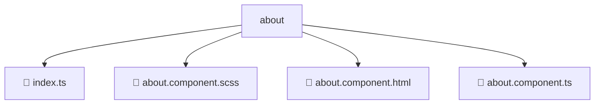

# 📂 ABOUT

> 💎 **Mavluda Beauty - Luxury Professional Architecture**

### 📍 Breadcrumb Navigation
`. > frontend > src > pages > about`

## 🎯 PURPOSE
This directory encapsulates `Pages` level functionality within the Mavluda Beauty ecosystem, ensuring proper separation of concerns and architectural transparency.

**FSD / Architecture Layer:** `Pages`

## 🏗️ ARCHITECTURE


## 📄 FILE REGISTRY

| Item Name | Type | Responsibility | Key Aliases Used |
|-----------|------|----------------|------------------|
| `📄 index.ts` | `.ts` | General functionality | `None` |
| `📄 about.component.scss` | `.scss` | Component logic | `None` |
| `📄 about.component.html` | `.html` | Component logic | `None` |
| `📄 about.component.ts` | `.ts` | Component logic | `@angular/forms/signals, @angular/platform-browser, @angular/core, @entities/admin-settings, @angular/common` |

## 🔗 DEPENDENCIES
- `@angular/forms/signals`
- `@angular/platform-browser`
- `@angular/core`
- `@entities/admin-settings`
- `@angular/common`

## 🛠️ USAGE
```typescript
// Example usage context
import { ... } from './index';

// Integrate index logic into your feature.
```
