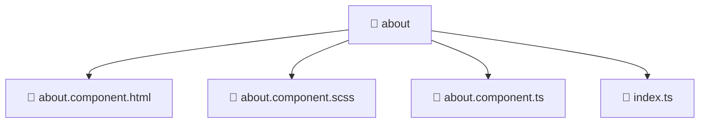

# 📁 about

[Root](/.) > [frontend](/frontend) > [src](/frontend/src) > [pages](/frontend/src/pages) > [about](/frontend/src/pages/about)

## 🎯 Purpose
Delivering luxury-tier architectural components and high-performance logic for the **about** domain. This directory is a crucial part of the Mavluda Beauty full-stack ecosystem, ensuring seamless scalability, robust performance, and an elite digital experience.

## 🏗️ Architecture


## 📄 File Registry
| File Name | Type | Responsibility | Key Aliases Used |
|---|---|---|---|
| `about.component.html` | HTML | Handles logic and definitions for about.component.html | None |
| `about.component.scss` | SCSS | Handles logic and definitions for about.component.scss | None |
| `about.component.ts` | TypeScript | Handles logic and definitions for about.component.ts | @angular/common, @angular/core, @angular/forms/signals, @angular/platform-browser, @entities/admin-settings |
| `index.ts` | TypeScript | Handles logic and definitions for index.ts | None |

## 🔗 Dependencies
- `@angular/common`
- `@angular/core`
- `@angular/forms/signals`
- `@angular/platform-browser`
- `@entities/admin-settings`

## 🛠️ Usage
```typescript
// Example usage within the Mavluda Beauty ecosystem
import { relevantMember } from './about';

// Integrate into the application architecture
relevantMember.execute();
```
