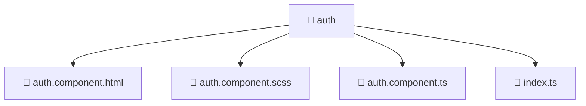

[Root](/.) > [frontend](/frontend) > [src](/frontend/src) > [pages](/frontend/src/pages) > [auth](/frontend/src/pages/auth)

# 📁 Auth (Pages Layer)

## 🎯 Purpose
Delivering luxury-tier architectural components and high-performance logic for the **auth** domain. This directory is a crucial part of the Mavluda Beauty full-stack ecosystem, ensuring seamless scalability, robust performance, and an elite digital experience.
This directory operates within the **Pages Layer** of the Feature Sliced Design (FSD) architecture.

## 🏗️ Architecture


## 📄 File Registry
| File Name | Type | Responsibility | Key Aliases Used |
|---|---|---|---|
| `auth.component.html` | HTML | Structural template and layout for auth.component.html. | N/A |
| `auth.component.scss` | CSS/SCSS | Luxury styling and visual presentation for auth.component.scss. | N/A |
| `auth.component.ts` | TypeScript | UI component logic and state management for auth.component.ts. | @angular, @entities, @features |
| `index.ts` | TypeScript | Provides core logic and orchestration for index.ts. | N/A |

## 🔗 Dependencies
- `./auth.component`, `@angular/common`, `@angular/core`, `@angular/forms/signals`, `@angular/router`, `@entities/user`, `@features/language-selection`

## 🛠️ Usage
```typescript
// Example usage within the Mavluda Beauty ecosystem
import { relevantMember } from './core';

// Integrate into the application architecture
relevantMember.execute();
```