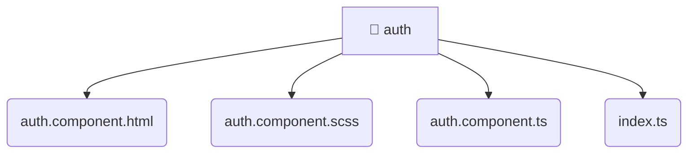

# [root](/) / [frontend](/frontend) / [src](/frontend/src) / [pages](/frontend/src/pages) / [auth](/frontend/src/pages/auth)

## 🏷️ 📁 Auth (Page Layer)

### 🎯 PURPOSE
The `auth` page component orchestrates the UI layer for the auth feature in the Mavluda Beauty frontend application.

### 🏗️ ARCHITECTURE


### 📄 FILE REGISTRY
| File Name | Type | Responsibility | Key Aliases Used |
|---|---|---|---|
| `auth.component.html` | `html` | UI template and styling. | None |
| `auth.component.scss` | `scss` | UI template and styling. | None |
| `auth.component.ts` | `ts` | UI component logic and rendering. | @angular, @entities, @features |
| `index.ts` | `ts` | Core logic implementation. | None |

### 🔗 DEPENDENCIES
- `./auth.component`
- `@angular/common`
- `@angular/core`
- `@angular/forms/signals`
- `@angular/router`
- `@entities/user`
- `@features/language-selection`

### 🛠️ USAGE
```typescript
// Seamlessly integrate auth into your refined workflows:
import { /* exported members */ } from '@path/to/auth';
```
