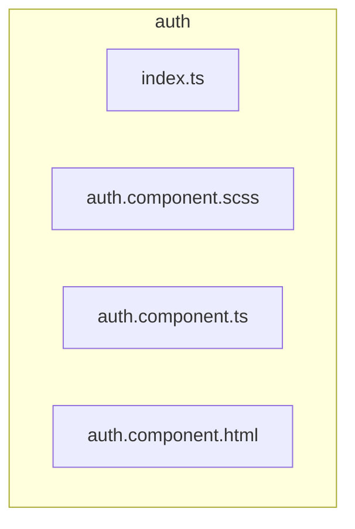

# 📁 auth

[frontend](../../../README.md) > [src](../../README.md) > [pages](../README.md) > [auth](README.md)

---

### 🎯 PURPOSE
Elevating the digital experience for the Mavluda Beauty ecosystem, this module manages the sophisticated Pages Layer (Routing and page-level components) operations.

*FSD Layer:* **Pages Layer (Routing and page-level components)**

---

### 🏗️ ARCHITECTURE



---

### 📄 FILE REGISTRY
| File Name | Type | Responsibility | Key Aliases Used |
|-----------|------|----------------|------------------|
| `index.ts` | Source | Handles source logic for Mavluda Beauty's luxury standards. | `None` |
| `auth.component.scss` | Styles | Handles styles logic for Mavluda Beauty's luxury standards. | `None` |
| `auth.component.ts` | Component | Handles component logic for Mavluda Beauty's luxury standards. | `@entities, @features, @angular` |
| `auth.component.html` | Template | Handles template logic for Mavluda Beauty's luxury standards. | `None` |

---

### 🔗 DEPENDENCIES
**Key Path Aliases Detected:** `@entities`, `@features`, `@angular`

Notable imports:
- `./auth.component`
- `@entities/user`
- `@angular/core`
- `@features/auth`
- `@angular/common`
- `@angular/router`
- `@features/auth/model/auth.model`
- `@features/language-selection`

---

### 🛠️ USAGE
To interact with this directory's luxurious logic, integrate its exported components or services directly into your feature modules. Ensure strict adherence to the Pages Layer (Routing and page-level components) boundaries.

```typescript
// Example integration snippet
import { FeatureModule } from '@path/to/auth';
```
