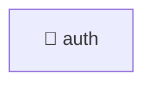

# 📁 auth

[Root](/.) / [frontend](../../..) / [src](../..) / [pages](..) / [auth](.)

## 🎯 Purpose
Delivering luxury-tier architectural components and high-performance logic for the **auth** domain. This directory orchestrates precise operations within the Mavluda Beauty ecosystem, maintaining our elite standards of digital excellence.

*This directory operates strictly within the **Pages** layer of our Feature Sliced Design (FSD) architecture.*

## 🏗️ Architecture


## 📄 File Registry
| File Name | Type | Responsibility | Key Aliases Used |
|---|---|---|---|
| `auth.component.html` | Template | Component template structural layout. | N/A |
| `auth.component.scss` | Styles | Luxury styling and brand aesthetics. | N/A |
| `auth.component.ts` | TypeScript | UI rendering and user interaction. | @angular, @entities, @features |
| `index.ts` | TypeScript | Core logic and utilities for this domain. | N/A |

## 🔗 Dependencies
- `@angular`
- `@entities`
- `@features`

## 🛠️ Usage
```markdown
> This directory acts primarily as a structural container or logic module.
> To interact with its contents, import the relevant exported members from the `index.ts` or specifically targeted files.
```
