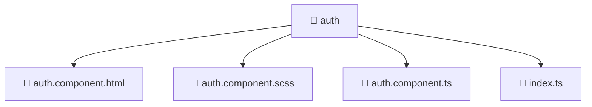

### 🧭 Breadcrumbs
[Root](/) > [frontend](/frontend) > [src](/frontend/src) > [pages](/frontend/src/pages) > [auth](/frontend/src/pages/auth)

# 📁 Auth Directory
**Architecture Layer:** Page Layer

## 🎯 Purpose
Provides luxury professional architectural implementation for the auth module within the Mavluda Beauty ecosystem. Ensure robust functionality and elegant integration with the broader architecture.

## 🏗️ ARCHITECTURE


## 📄 FILE REGISTRY
| File Name | Type | Responsibility | Key Aliases Used |
|---|---|---|---|
| `auth.component.html` | HTML Template | Structural template and layout for auth.component.html. | N/A |
| `auth.component.scss` | Stylesheet | Luxury styling and visual presentation for auth.component.scss. | N/A |
| `auth.component.ts` | TypeScript | UI component logic and state management for auth.component.ts. | @features/auth/model/auth.model, @angular/common, @angular/core, @angular/router, @entities/user, @features/language-selection, @features/auth |
| `index.ts` | TypeScript | Provides core logic and orchestration for index.ts. | N/A |

## 🔗 DEPENDENCIES
- `@angular/common`
- `@angular/core`
- `@angular/router`
- `@entities/user`
- `@features/auth`
- `@features/auth/model/auth.model`
- `@features/language-selection`

## 🛠️ USAGE
```typescript
// Example architectural integration for auth
// Utilize the exported members according to Mavluda Beauty's standard conventions.
```

---
*Maintained by Mavluda Beauty - Architecture & Engineering*

---
*Maintained by Mavluda Beauty - Architecture & Engineering*