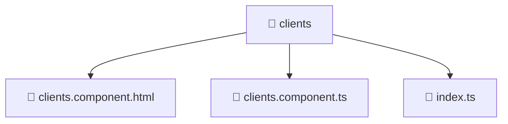

# 📁 clients

[Root](/.) > [frontend](/frontend) > [src](/frontend/src) > [pages](/frontend/src/pages) > [clients](/frontend/src/pages/clients)

## 🎯 Purpose
Delivering luxury-tier architectural components and high-performance logic for the **clients** domain. This directory is a crucial part of the Mavluda Beauty full-stack ecosystem, ensuring seamless scalability, robust performance, and an elite digital experience.
> **FSD Layer:** Pages - Adhering to strict Feature Sliced Design architectural constraints.

## 🏗️ Architecture


## 📄 File Registry
| File Name | Type | Responsibility | Key Aliases Used |
|---|---|---|---|
| `clients.component.html` | Template | Visual layout and structural HTML. | N/A |
| `clients.component.ts` | Component | UI rendering and component-level state. | @angular, @entities, @features, @shared |
| `index.ts` | File | Core logic and utilities for this domain. | N/A |


## 🔗 Dependencies
- `@angular/core`
- `@angular/common`
- `@angular/forms`
- `@entities/user`
- `@features/client-form`
- `@shared/ui`
- `./clients.component`

## 🛠️ Usage
```typescript
// Example usage within the Mavluda Beauty ecosystem
import { relevantMember } from './clients.component';

// Integrate into the application architecture
relevantMember.execute();
```
