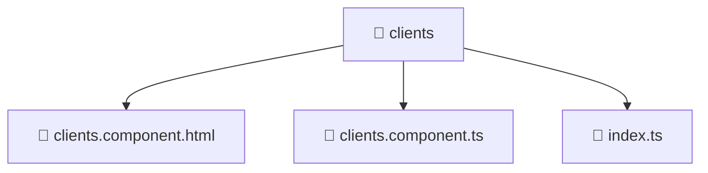

# 📁 clients

[Root](/.) > [frontend](/frontend) > [src](/frontend/src) > [pages](/frontend/src/pages) > [clients](/frontend/src/pages/clients)

**FSD Layer:** Page

## 🎯 Purpose
Frontend UI components containing template structures, styling, and specific behavioral logic.

## 🏗️ Architecture


## 📄 File Registry
| File Name | Type | Responsibility | Key Aliases Used |
|---|---|---|---|
| `clients.component.html` | Template | Structural template and layout for clients.component.html. | N/A |
| `clients.component.ts` | TypeScript | UI component logic and state management for clients.component.ts. | @angular, @entities, @features, @shared |
| `index.ts` | TypeScript | Provides core logic and orchestration for index.ts. | N/A |

## 🔗 Dependencies
- `@angular/common`
- `@angular/core`
- `@angular/forms`
- `@entities/user`
- `@features/client-form`
- `@shared/ui`

## 🛠️ Usage
```html
<!-- Example usage in a parent component template -->
<app-component-selector></app-component-selector>
```
