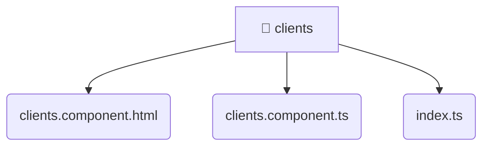

# [frontend](/frontend) / [src](/frontend/src) / [pages](/frontend/src/pages) / [clients](/frontend/src/pages/clients)

## 🏷️ 📁 Clients

### 🎯 PURPOSE
The `clients` directory forms a critical foundation within the Mavluda Beauty ecosystem, meticulously orchestrating the clients logic to ensure a seamless and premium experience. Integrated within our cutting-edge Angular frontend architecture, it crafts an elegant, highly-responsive user interface reflecting our luxury brand standards. This module is a distinguished component of the **Pages** layer under the Feature Sliced Design (FSD) methodology.

### 🏗️ ARCHITECTURE


### 📄 FILE REGISTRY
| File Name | Type | Responsibility | Key Aliases Used |
|---|---|---|---|
| `clients.component.html` | `html` | Encapsulates premium logic and definitions for `clients.component.html`. | None |
| `clients.component.ts` | `ts` | Encapsulates premium logic and definitions for `clients.component.ts`. | @shared/ui, @features/client-form, @angular/common, @angular/core, @angular/forms, @entities/user |
| `index.ts` | `ts` | Encapsulates premium logic and definitions for `index.ts`. | None |


### 🔗 DEPENDENCIES
- `@angular/common`
- `@angular/core`
- `@angular/forms`
- `@entities/user`
- `@features/client-form`
- `@shared/ui`

### 🛠️ USAGE
```typescript
// Seamlessly integrate clients into your refined workflows:
import { /* exported members */ } from '@path/to/clients';
```
