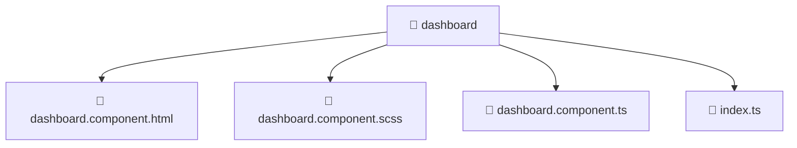

# 📁 dashboard

[Root](/.) > [frontend](/frontend) > [src](/frontend/src) > [pages](/frontend/src/pages) > [dashboard](/frontend/src/pages/dashboard)

## 🎯 Purpose
Delivering luxury-tier architectural components and high-performance logic for the **dashboard** domain. This directory is a crucial part of the Mavluda Beauty full-stack ecosystem, ensuring seamless scalability, robust performance, and an elite digital experience.

## 🏗️ Architecture


## 📄 File Registry
| File Name | Type | Responsibility | Key Aliases Used |
|---|---|---|---|
| `dashboard.component.html` | HTML | Handles logic and definitions for dashboard.component.html | None |
| `dashboard.component.scss` | SCSS | Handles logic and definitions for dashboard.component.scss | None |
| `dashboard.component.ts` | TypeScript | Handles logic and definitions for dashboard.component.ts | @angular/common, @angular/core, @entities/gallery/gallery.service, @entities/treatments/treatments.service, @entities/user/user.service, @entities/veil/veil.service |
| `index.ts` | TypeScript | Handles logic and definitions for index.ts | None |

## 🔗 Dependencies
- `@angular/common`
- `@angular/core`
- `@entities/gallery/gallery.service`
- `@entities/treatments/treatments.service`
- `@entities/user/user.service`
- `@entities/veil/veil.service`
- `rxjs`

## 🛠️ Usage
```typescript
// Example usage within the Mavluda Beauty ecosystem
import { relevantMember } from './dashboard';

// Integrate into the application architecture
relevantMember.execute();
```
