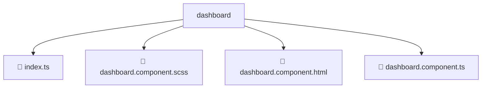

# 📂 DASHBOARD

> 💎 **Mavluda Beauty - Luxury Professional Architecture**

### 📍 Breadcrumb Navigation
`. > frontend > src > pages > dashboard`

## 🎯 PURPOSE
This directory encapsulates `Pages` level functionality within the Mavluda Beauty ecosystem, ensuring proper separation of concerns and architectural transparency.

**FSD / Architecture Layer:** `Pages`

## 🏗️ ARCHITECTURE


## 📄 FILE REGISTRY

| Item Name | Type | Responsibility | Key Aliases Used |
|-----------|------|----------------|------------------|
| `📄 index.ts` | `.ts` | General functionality | `None` |
| `📄 dashboard.component.scss` | `.scss` | Component logic | `None` |
| `📄 dashboard.component.html` | `.html` | Component logic | `None` |
| `📄 dashboard.component.ts` | `.ts` | Component logic | `@angular/core, @entities/treatments/treatments.service, @entities/user/user.service, @angular/common, @entities/veil/veil.service, @entities/gallery/gallery.service` |

## 🔗 DEPENDENCIES
- `@angular/core`
- `@entities/treatments/treatments.service`
- `@entities/user/user.service`
- `@angular/common`
- `@entities/veil/veil.service`
- `@entities/gallery/gallery.service`

## 🛠️ USAGE
```typescript
// Example usage context
import { ... } from './index';

// Integrate index logic into your feature.
```
