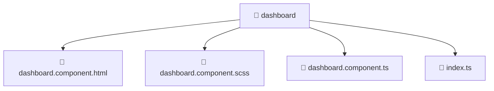

### 🧭 Breadcrumbs
[Root](/) > [frontend](/frontend) > [src](/frontend/src) > [pages](/frontend/src/pages) > [dashboard](/frontend/src/pages/dashboard)

# 📁 Dashboard Directory
**Architecture Layer:** Page Layer

## 🎯 Purpose
Provides luxury professional architectural implementation for the dashboard module within the Mavluda Beauty ecosystem. Ensure robust functionality and elegant integration with the broader architecture.

## 🏗️ ARCHITECTURE


## 📄 FILE REGISTRY
| File Name | Type | Responsibility | Key Aliases Used |
|---|---|---|---|
| `dashboard.component.html` | HTML Template | Structural template and layout for dashboard.component.html. | N/A |
| `dashboard.component.scss` | Stylesheet | Luxury styling and visual presentation for dashboard.component.scss. | N/A |
| `dashboard.component.ts` | TypeScript | UI component logic and state management for dashboard.component.ts. | @angular/common, @entities/veil/veil.service, @angular/core, @entities/treatments/treatments.service, @entities/gallery/gallery.service, @entities/user/user.service |
| `index.ts` | TypeScript | Provides core logic and orchestration for index.ts. | N/A |

## 🔗 DEPENDENCIES
- `@angular/common`
- `@angular/core`
- `@entities/gallery/gallery.service`
- `@entities/treatments/treatments.service`
- `@entities/user/user.service`
- `@entities/veil/veil.service`

## 🛠️ USAGE
```typescript
// Example architectural integration for dashboard
// Utilize the exported members according to Mavluda Beauty's standard conventions.
```

---
*Maintained by Mavluda Beauty - Architecture & Engineering*

---
*Maintained by Mavluda Beauty - Architecture & Engineering*