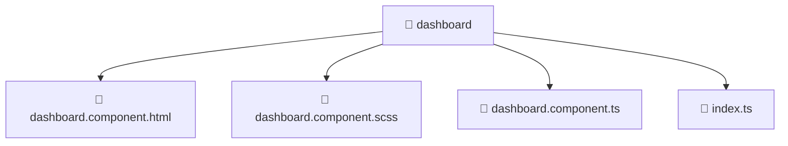

<!--
Mavluda Beauty - Luxury Professional Documentation
Generated for 100% Architectural Transparency
-->
[Home](../../../../README.md) > [frontend](../../../README.md) > [src](../../README.md) > [pages](../README.md) > [dashboard](./README.md)

# 📁 DASHBOARD Directory

> **FSD Layer:** Pages

## 🎯 PURPOSE
Represents full application views and routes orchestrating widgets and features.

## 🏗️ ARCHITECTURE


## 📄 FILE REGISTRY
| File Name | Type | Responsibility | Key Aliases Used |
|---|---|---|---|
| `dashboard.component.html` | HTML Template | UI rendering and component logic. | - |
| `dashboard.component.scss` | Styles | UI rendering and component logic. | - |
| `dashboard.component.ts` | TypeScript | UI rendering and component logic. | @angular |
| `index.ts` | TypeScript | Core logic implementation. | - |


## 🔗 DEPENDENCIES
- `@angular/core`
- `@angular/common`

## 🛠️ USAGE
```typescript
// Example placeholder for interacting with dashboard
// Consult the individual files in the registry for specific APIs.
```
